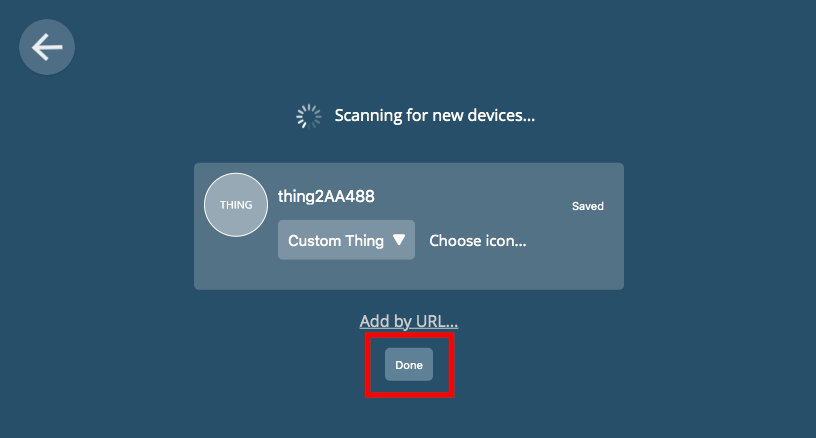

# Creating WebThings with JavaScript on Microcontrollers

This document explains how to install WebThings examples on the oddWires IoT-Bus development board from a browser-based interface.

## Table of Contents

* [Configuring your Device](#config)
* [About the WebIDE](#webide)
* [Running Examples](#examples)
* [Connecting to the WebThings Gateway](#gateway)
* [Troubleshooting](#troubleshooting)

<a id="config"></a>
## Configuring your Device

When you power your device, you'll see the following screen.


### Connecting to Wi-Fi

Before you can run examples to turn the device into WebThing, you need to connnect it to Wi-Fi. Tap the Wi-Fi button at the top of the screen and the device will scan for available networks. Tapping a network displays an on-screen keyboard that allows you to enter the password.


After you connect to a network, the application saves the Wi-Fi credentials and returns to the main screen. On subsequent boots, it will attempt to connect to the same network so you don't have to enter the password again.

### Naming your Device

By default, each device has a unique name. You can optionally change the name by tapping the Name button in the middle of the screen. This name will be used as the hostname of your device so you can easily determine which device is yours from the gateway.


<a id="webide"></a>
## About the WebIDE

The WebIDE allows you to install JavaScript applications built with the Moddable SDK on your device from the browser. It is an alternative to some of the command line build tools provided by the Moddable SDK.

It is available at [https://ide.moddable.com](https://ide.moddable.com).


Note that the WebIDE uses [WebUSB](https://developers.google.com/web/updates/2016/03/access-usb-devices-on-the-web) to connect to devices, so it only works in Chrome. If you don't have Chrome already, you can download it [here](https://www.google.com/chrome/).

> The repository for the project is [on GitHub](https://github.com/FWeinb/moddable-webide). Special thanks to [FWeinb](https://github.com/FWeinb) for developing it.

<a id="examples"></a>
## Running Examples

A variety of examples are available for you to get started with. There is a basic on/off light, a digital sign, and a thermometer.


To run an example, take the following steps.

1. Go to the Projects view in the WebIDE and click **Import GitHub Gist**.

	

3. Enter a name for the project.

	
	
4. Enter the gist ID for the example you want to run.

	- On/off light: `c2e638a2e8ebaff796d67f2d2dd0783d`
	- Digital sign: `9f526d43030bd3c96fead27eebaf5303`
	- Thermometer: `514a010e7acff8520f60839ecc749da5`

	
	
5. In the top right corner, select **USB** and **ESP32** from the drop-down menus.

	
	
6. Click the **Flash** button to install the application.

	
	
7. Your device will show up as a **CP2104 USB to UART Bridge Controller**. Select the device and click the **Connect** button to connect to it.

	
	
7. If the installation is successful, you will see the following messages traced to the Log at the bottom of the WebIDE.

	

	The device will restart and go back to the main screen. After it connects to Wi-Fi, the **Run** button will become active. Tap the Run button to run the application you installed.

	
	
<a id="gateway"></a>
## Connecting to the WebThings Gateway

To connect to your device from the WebThings Gateway, take the following steps.

1. Click the **+** button to start scanning for devices.

	

2. Your device should be discovered automatically. If it's not, press **Add by URL...**, enter the URL of the device's description, and press **Submit**. The URL is of the format:

	`<DEVICE_NAME>.local/thng/desc/<DEVICE_NAME>`

	For example, if your device is named `thing2AA488`, it would be `thing2AA488.local/thng/desc/thing2AA488`.
	
	

3. Press the **Save** button to add it to your Things page. Then press **Done** to go to the Things page.

	 
	
	

Now you can interact with the device as you would with any other WebThing. You can control its state, monitor its properties, create rules, and more. See the [Gateway User Guide](https://iot.mozilla.org/docs/gateway-user-guide.html) for more information on all the features of the WebThings Gateway.

<a id="troubleshooting"></a>
## Troubleshooting

This section lists common issues and how to resolve them.

### NetworkError: Unable to claim interface

If you have the [Silicon Labs VCP Driver](https://www.silabs.com/products/development-tools/software/usb-to-uart-bridge-vcp-drivers) installed, you will get the following error when you try to install an application on your device from the WebIDE:

```
NetworkError: Unable to claim interface.
** Looks like you need to uninstall the driver **
```

You can uninstall the driver by running the uninstall script provided by Silicon Labs. Alternatively, you can disable it while you use the WebIDE, then re-enable it when you're done.

To disable the VCP driver, run the following command from Terminal:

```
sudo kextunload -b com.silabs.driver.CP210xVCPDriver
```

To re-enable the VCP driver, run the following command from Terminal:

```
sudo kextload -b com.silabs.driver.CP210xVCPDriver
```

### Touch screen doesn't work properly

### Device hangs during installation


